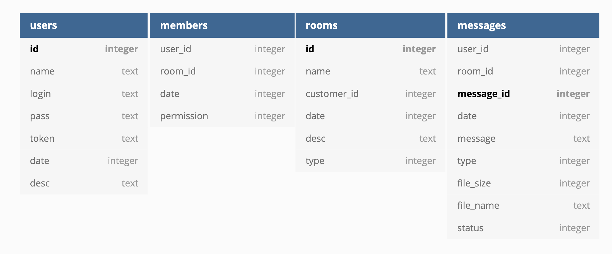

# Database

created four tables for convenient data storage

- users
- rooms
- messages
- members

---

## users

a table that stores data about all users

- __id__    -> unique user number **created from the primary key**
- __name__  -> not a unique username
- __login__ -> unique user login for login
- __pass__  -> user password
- __token__ -> token for file transfer
- __date__  -> user registration time in milliseconds
- __desc__  -> user description

---

## rooms

a table that stores data about all users

- __id__ -> unique room number **created from the primary key**
- __name__ -> not a unique room name
- __customer_id__ -> id of the user who created this room
- __date__ -> time to create a commandant in milliseconds
- __desc__ -> room description
- __type__ -> room type, example: `DB_PRIVAT_CHAT, DB_GLOBAL_CHAT, DB_LS_CHAT`

---

## messages

a table that stores data about all messages

- __user_id__ -> the number of the user who created this message
- __room_id__ -> the number of the room to which the message was sent
- __message_id__ -> unique message number **created from the primary key**
- __date__ -> message creation time in milliseconds
- __message__ -> if the message has a message then it is its text else `NULL`
- __type__ -> type message, example: `DB_TEXT_MSG, DB_FILE_MSG, DB_FILE_TEXT_MSG, DB_STICKER`
- __file_size__ -> if the message has a file then it is its size else `0`
- __file_name__ -> if the message has a file then it is its name else `NULL`
- __status__ -> status message, example: `DB_MESSAGE_START, DB_MESSAGE_EDIT`

---

## members

a table that stores the location data of all users

- __user_id__ -> the number of the user who is in the room under the number `room_id`
- __room_id__ -> the room number in which the user is located under the `user_id` number
- __date__ -> time in milliseconds when the user entered `user_id` entered the room `room_id`
- __permission__ -> user permissions in room `room_id`

---
